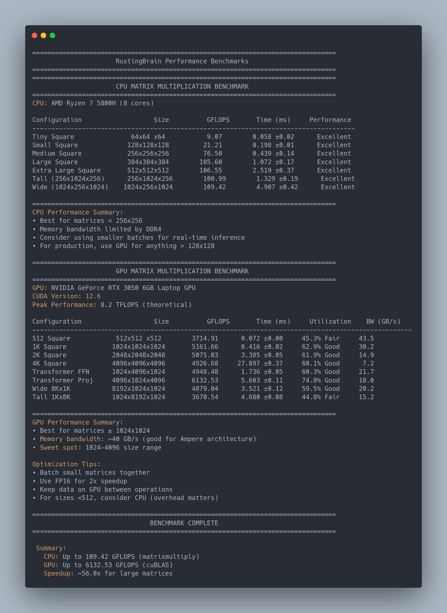

# 🦀 RustingBrain

**A lightweight neural network library written from scratch in pure Rust.**

RustingBrain is a foundational deep learning project designed to **demystify the mathematics behind Artificial Intelligence**. It implements **matrix operations, feedforward propagation, and backpropagation** without relying on heavy frameworks such as TensorFlow or PyTorch.

The project is meant primarily as an **educational deep learning engine**, helping developers understand how neural networks actually learn internally.

---

# ⚡ Features

- **Custom Matrix Engine**  
  High-performance linear algebra built on top of `matrixmultiply`.

- **GPU Acceleration (CUDA)**  
  Optional GPU backend using **cuBLAS via `cudarc`**.

- **Dynamic Neural Architectures**  
  Easily define networks such as:

```

2 → 8 → 4 → 1

```

- **Backpropagation Training**
  Implements gradient descent with forward/backward passes.

- **Tensor Backend Abstraction**
  The same network code works with multiple backends:

```

Network<Matrix> // CPU
Network<GpuMatrix> // CUDA GPU

```

- **Minimal Dependencies**
  Only small libraries like `rand`, `rayon`, and `matrixmultiply`.

---

# 📦 Installation

Clone the repository:

```bash
git clone https://github.com/your-username/RustingBrain.git
cd RustingBrain
cargo run
```

To run benchmarks:

```bash
cargo run --release
```

---

# 🚀 Example

A simple neural network:

```rust
use crate::network::Network;
use crate::matrix::Matrix;

fn main() {

    // 2 inputs -> 3 hidden -> 1 output
    let layers = vec![2, 3, 1];

    let mut net = Network::<Matrix>::new(layers, 0.01);

    let input = vec![1.0, 0.0];
    let target = vec![1.0];

    for _ in 0..10_000 {
        net.train(&input, &target);
    }

    let prediction = net.forward(&input);

    println!("Prediction: {:?}", prediction);
}
```

---

# 📊 Performance Benchmarks

RustingBrain includes **CPU and GPU benchmarks** for matrix multiplication — the core operation behind neural networks.

The benchmark compares:

- CPU (`matrixmultiply`)
- GPU (`cuBLAS`)

### Benchmark Results



---

## CPU Matrix Multiplication

**CPU:** AMD Ryzen 7 5800H (8 cores)

Peak observed performance:

```
109.42 GFLOPS
```

CPU performs best for **small matrices (<256×256)** where GPU overhead dominates.

---

## GPU Matrix Multiplication

**GPU:** NVIDIA RTX 3050 Laptop GPU
**CUDA:** 12.6

Peak observed performance:

```
6132.53 GFLOPS
```

GPU performs best for **large matrices (≥1024×1024)**.

---

## Performance Comparison

| Hardware | Peak Performance |
| -------- | ---------------- |
| CPU      | ~109 GFLOPS      |
| GPU      | ~6132 GFLOPS     |

**Speedup**

```
~56× faster on GPU for large matrices
```

---

## Optimization Notes

Best practices discovered from benchmarking:

- Batch small matrices together
- Keep tensors on GPU between operations
- Use FP16 for ~2× speedup
- For matrices smaller than **512×512**, CPU may be faster

---

# 🧠 Project Architecture

```
src/
 ├── main.rs          # Benchmark runner / examples
 ├── network.rs       # Neural network + backpropagation
 ├── tensor.rs        # Tensor trait abstraction
 ├── matrix.rs        # CPU tensor implementation
 ├── gpu_matrix.rs    # CUDA tensor implementation
 ├── xor.rs           # XOR example
 ├── complex.rs       # Larger network examples
 └── gpu_test.rs      # GPU benchmarks
```

---

# ⚙️ Core Design

RustingBrain uses a **backend abstraction layer**:

```
Tensor trait
   │
   ├── Matrix (CPU backend)
   │
   └── GpuMatrix (CUDA backend)
```

This allows the **same neural network code** to run on either **CPU or GPU**.

---

# 🛣️ Roadmap

Future improvements planned:

- [ ] FP16 / mixed precision training
- [ ] Model serialization (save/load weights)
- [ ] Additional activation functions
- [ ] Convolution layers
- [ ] Optimizers (Adam, RMSProp)
- [ ] Transformer experiments
- [ ] GPU backpropagation kernels

---

# 🤝 Contributing

Contributions are welcome!

1. Fork the project
2. Create a feature branch

```
git checkout -b feature/AmazingFeature
```

3. Commit changes
4. Open a Pull Request

Ideas for contributions:

- Faster CUDA kernels
- Additional tensor operations
- Optimized batching
- Training examples

---

# 📄 License

Distributed under the **MIT License**.

---

# ⭐ Why RustingBrain?

Most ML libraries hide the math.

RustingBrain shows it.

You can read the code and directly see:

```
Forward Pass
Weight Multiplication
Error Propagation
Gradient Updates
```

It’s a **neural network engine you can fully understand**.
